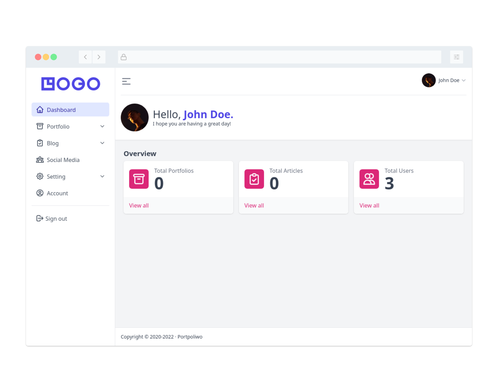

# Portpoliwo

[](https://github.com/hapakaien/portpoliwo/actions) 



Portpoliwo is a simple headless CMS for personal portfolio site. This project
uses [Laravel](https://github.com/laravel/laravel) as back-end, and
[Vue.js](https://github.com/vuejs/vue) as front-end (SPA).  

Here are some of the features it includes:

- Easy authentication with Laravel Sanctum
- Using Redis as session and cache driver
- Storage flexibility with S3-compatible object storage
- Replace Laravel Mix with Vite for faster front-end development
- Lightweight UI with Headless UI, Oruga UI, Tiptap, SVG icons and Windi CSS

## Setup

If you are interested in trying Portpoliwo, you can do the following.

### Local

For local setup, you need at least 2 terminals open at the same time.

1. Clone this repository to your machine.

   ```bash
   git clone -b v3 --depth 1 --single-branch https://github.com/hapakaien/portpoliwo.git && cd portpoliwo
   ```

2. Install dependencies.

    ```bash
    composer install && pnpm install
    ```

3. Copy `.env.example` file to `.env`.

	```bash
	cp .env.example .env
	```
	This file will be used by Laravel, Vue, and Docker Compose during development.

4. Run all managed services with Docker Compose, and wait for all containers to run perfectly.

   ```bash
   docker-compose up -d
   ```

5. Set up application with artisan command.

   ```bash
   php artisan app:install
   ```

6. Start Vue development server.

   ```bash
   pnpm dev
   ```

7. Open second terminal at the same location, and start Laravel development server.

   ```bash
   php artisan serve
   ```
   
   If all goes well, you can immediately try opening http://localhost:8000 in the browser.
   
   You can try logging in with the account in the [database/seeders/UsersTableSeeder.php](database/seeders/UsersTableSeeder.php) file.

## Testing

### Laravel

To perform the test, you can start with steps 1 and 2 in [local setup](#local). After that, you can proceed with the following steps.

1. Run all managed services with Docker Compose, and wait for all containers to run perfectly.

   ```bash
   docker-compose -p portpoliwo-test --env-file .env.testing
   ```

2. Run test.

   ```bash
   php artisan test
   ```
